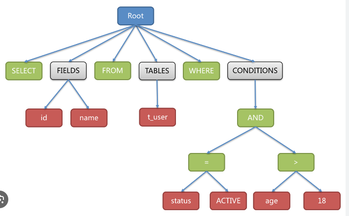
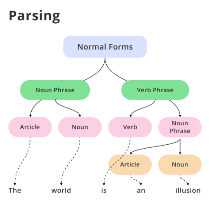

# небольшое введение

Цель - парсинг (web crawling + web scraping + parsing). Само понятие парсинг более обширно, имеется ввиду распознавать текст, написанный в определенной форме (формате), или же более глобально в определенной грамматике. Например выражения в SQL тоже парсятся посредством SQL engine, разбиваясь на токены. Есть целая теория про это, и это не совсем то, что нам нужно, но возникает вопрос, почему постоянно говорят `парсить`. Имеется ввиду парсить `HTML` контент страницы и вытаскивать оттуда нужную информацию "используя определенную грамматику". Примерно так это выглядит:

 

Для `HTML` такой парсинг подразумевает обработку различных тегов (`

, , <table></table>` и т.д.). Для этих целей уже есть готовый набор инструментов как универсальных так и для Python в частности, это например очень популярные библиотеки `BeautifulSoup` и `lxml`. Парсинг сам по себе не сложен, если знать где и какая именно информация в `HTML` контенте тебе нужна. Однако, достать сам `HTML` уже другая задача - это задача **web scraping**.

**Web scraping** и **web crawling** хоть и не одно и то же, но оба грубо говоря подразумевают автоматический сбор данных с web страницы (сайт) / приложения. Для скрейпинга используется целый ряд методов начиная от парсинга HTML, захвата XHR запросов (intercept requests), автоматизации браузера (`Selenium, Puppeteer, Playwright`) для динамических сайтов (использующих Javascript (heavy Javascript), а точнее frontend технологии (`Vue, Angular, React`)) и все остальное. Для этих методов уже все продумано и придумано, например для захвата запросов нам нужен HTTP клиент, который будет выполнять запросы к серверу (сайту) (HTTP запросы -> например вводишь google.com это значит запрос HTTP GET google.com) и получать response от сервера, в котором возможно будет HTML, возможно потому что может быть и просто текст и JSON и XML (зависит от того, как обрабатывается запрос на сервере, т е как написано приложение + какие политики и т д). Самый популярный для Python это `requests`, очень полезно знать `curl` - универсальный и фундаментальный клиент, и такие приколюхи как Postman.

Что касается Web crawling, это грубо говоря архитектурное решение скрейпинга большого количества сайтов (URL), самое эталонное решение это роботы Google - [Googlebot](https://en.wikipedia.org/wiki/Googlebot). Для Python используют `scrapy`, однако саму систему конечно же надо продумать.

## Computer Science basics [в разработке]

Про общий кругозор в `computer science` и те пункты, которые прямо или косвенно касаются нашей цели, пока что не расписываю, так как это вещи, которые невозможно изучить по списку, но целом полная картина будет складываться с учетом этих базовых концепций

* Алгоритмы и структуры данных
* Concurrency (асинхронное программирование, параллельное программирование)
* Сетевые протоколы
* Сериализация/десериализация
* Linux (Ubuntu/Debian)
* Git
* Базы данных (SQL)
* ...

## Technologies

Сначала надо определиться какие технологии и инструменты нужны для работы, и какие концепции нужно знать. Попытаемся перечислить некоторые самые важные концепции, которые важно знать

* HTTP protocol
  * методы (GET, POST), статусы, заголовки запроса/ответа, тело запроса/ответа, Cookies, в целом как это все работает.
  * слишком глубоко (по транспортным протоколам [по иерархии OSI](https://ru.wikipedia.org/wiki/%D0%A1%D0%B5%D1%82%D0%B5%D0%B2%D0%B0%D1%8F_%D0%BC%D0%BE%D0%B4%D0%B5%D0%BB%D1%8C_OSI) или же по `socket programming`) копать пока нет смысла, так как манипуляции на уровне протокола TCP/UDP или на уровне пакетов не так практичны для нашей задачи.
  * поизучать `curl`, только этот туториал из официальной документации содержит массу полезной информации [curl - Tutorial](https://curl.se/docs/tutorial.html)
  * посмотреть версии HTTP, 1.0, 1.1, 2.0 и 3.0(опционально), можно поверхностно для начала
  * после `curl` полезно изучить (т е посмотреть документацию + best practices + пару туторилов желательно из документации) еще какой-нибудь клиент для конкретного языка программирования. Например `requests` для Python
* Browser
  * **Devtools** важная штука для нашей задачи, во первых все наблюдения проводим мы в основном в браузере, о чень важно знать как работать с ним. Пока что можно заострить внимание на вкладках `Network`, `Elements` и `Console`.
  * HTML (+ [rendering strategies](https://developer.mozilla.org/en-US/docs/Web/Performance/How_browsers_work)) базовые знания разметки HTML нужны обязательно, какие теги бывают (часто встречаемые), что такое атрибуты, inner text и другие элементы HTML. Лучший ресурс и для HTML и для HTTP, а также для многих концепций по Web - [Mozilla MDN Web Docs](https://developer.mozilla.org/en-US/)
  * advanced концепты - service workers, browser extensions, Web APIs пока что не будем затрагивать
* Javascript
  * Вне зависимости от того на каком языке писать бота (парсера) и какими инструментами пользоваться, без знаний Javascript далеко в этом деле не продвинуться. Самые базовые концепции также смотрим на [MDN](https://developer.mozilla.org/en-US/docs/Web/JavaScript). Желательно знать JS на базовом уровне для написания простых сниппетов (кусок кода) в консоли DevTools, а в идеале иметь представление о главных фронтенд фреймворках по типу React + базовый JS на уровне написания простых програм на NodeJS.
* Далее концепции, которые на начальных этапах хорошо знать: Proxy, Redirect, Bot detection, Browser fingerprint

## Python

Ресурсов очень много, и что-то конкретное сложно посоветовать, перечислю то, что я сам использовал:

* Лекции от Тимофея Хирьянова:
  * ["Практика программирования на Python" (2020)](https://www.youtube.com/playlist?list=PLRDzFCPr95fIDJUvFxvzWxg-V9BmZlMMe) - по Python, но очень важно параллельно решать задачи, без задач ценность 50%
  * ["Алгоритмы и структуры данных на Python" (2018)](https://www.youtube.com/playlist?list=PLRDzFCPr95fK7tr47883DFUbm4GeOjjc0) - для общего развития, вопрос практичности изучения алгоритмов и ДС для задач допустим скрейпинга может быть [спорной](https://www.reddit.com/r/learnprogramming/comments/gmilz4/how_important_are_algorithms_to_web_development/), но для глобальных и сложных вещей без этих знаний не обойтись, как например при проектировании `crawler` а
* Hands-on tutorials эффективны для быстрого ознакомления новичков с языком в общих чертах. Плюс данного типа источников в том, что задачи и примеры часто можно воспроизводить интерактивно в любой [REPL](https://ru.wikipedia.org/wiki/REPL) среде
  * [Hands-on Python 3 Tutorial - Loyola University Chicago](http://anh.cs.luc.edu/python/hands-on/3.1/handsonHtml/index.html) - немного outdated, но очень полезный для новичков
* Youtube каналы это и плюс и минус, так как их очень много, особенно по Python, и многие из них не лучшего качества. Если дойти скажем до вполне разумного уровня владения языком, то искать качественный или даже авторский материал становится труднее, но есть устоявшиеся каналы:
  * [Tech with Tim](https://www.youtube.com/c/TechWithTim)
    * [Corey Schafer](https://www.youtube.com/channel/UCCezIgC97PvUuR4_gbFUs5g)
    * [sentdex](https://www.youtube.com/channel/UCfzlCWGWYyIQ0aLC5w48gBQ)
* Reddit - максимально полезный источник для поиска источников, просто пишем в поиске `python programming resources` и получаем ответы, иногда находятся очень интересные варианты, в целом рекомендую
